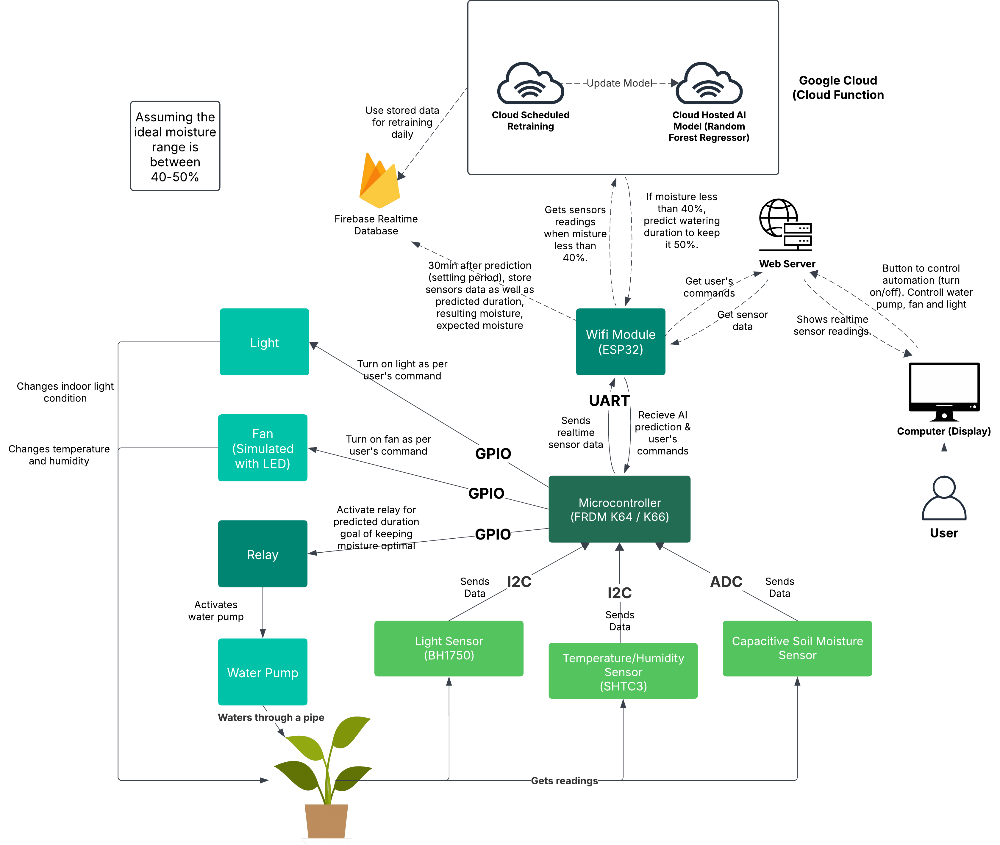

# AI-Based Automated Plant Watering System

## System Overview

This project implements an intelligent, automated watering system that:

1. Predicts optimal watering durations using environmental conditions  
2. Continuously learns from watering outcomes  
3. Maintains optimal soil moisture (target: 50%)



---

## Key Components

### Data Flow

- **Sensor Logs**: Initial conditions before watering  
```json
{
  "2025-03-19 9:54:00": {
    "temperature": 24.2,
    "humidity": 61.9,
    "light": 19.2,
    "moisture_before": 38.7,
  }
}

```
- **Prediction Logs**: Watering actions and outcomes  
```json
{
  "2025-03-19 10:24:00": {
    "temperature": 24.2,
    "humidity": 61.9,
    "light": 19.2,
    "moisture_before": 38.7,
    "predicted_time": 10,
    "moisture_after": 48.5
  }
}

```

---

## Hardware Setup

### Hardware Setup Diagram


This system runs on an **NXP K66F Freedom board**, connected to the following peripherals:

- **Soil Moisture Sensor** (AnalogIn – PTB7)  
- **SHTC3 Temperature & Humidity Sensor** (I2C – PTC11/PTC10)  
- **BH1750 Light Sensor** (I2C – PTB3/PTB2)  
- **Relay Module** (DigitalOut – PTA1) for pump control  
- **LEDs** for fan (PTC8) and light (PTC16) indicators  
- **UART** interface for serial communication with the ESP32 (PTC4/PTC3)

---

## ESP32 Setup

The ESP32 handles AI integration, Firebase logging, offline buffering, and dashboard display.

### Prerequisites

- Arduino IDE  
- ESP32 board package  
- Required libraries:
  - `WiFi`
  - `HTTPClient`
  - `NTPClient`
  - `WiFiUdp`
  - `SPIFFS`

### `secrets.h` Configuration

Create a `secrets.h` file in the same directory as your `.ino` file with the following content:

```cpp
const char* WIFI_SSID = "your_wifi_ssid";
const char* WIFI_PASSWORD = "your_wifi_password";
const char* FIREBASE_URL = "https://your_firebase_project_url/";
const char* PREDICT_URL = "https://us-central1-yourproject.cloudfunctions.net/predict_watering";
const char* FIREBASE_SECRET = "your_firebase_database_secret";
```

Replace all placeholder values with your actual credentials. This file should not be committed to version control.

---

## Core Functions

### 1. Initial Model Training (`train.py`)

**Purpose**: Train the baseline RandomForest model using historical data.

**Usage**:
```bash
python train.py
```

**Input**: Firebase `sensor_data` with:
- `temp`, `humidity`, `light`, `init_moisture`, `watering_duration`, `final_moisture`

**Output**:  
- `base_model.pkl`

---

### 2. Prediction Function (`predict.py`)

**Endpoint**: `POST /predict_watering`

**Input**:
```json
{
  "temp": 24.5,
  "humidity": 60.1,
  "light": 850.3,
  "init_moisture": 35.2
}
```

**Output**:
```json
{
  "watering_duration": 45.2
}
```

**Deployment**:
```bash
gcloud functions deploy predict_watering \
  --runtime python39 \
  --trigger-http \
  --allow-unauthenticated \
  --memory=256MB \
  --timeout=30s \
  --region=us-central1
```

---

### 3. Retraining Function (`retrain_model.py`)

**Endpoint**: `POST /retrain_model`  
**Trigger**: Automatically after collecting new data

**Process**:
1. Pair sensor logs with outcomes
2. Calculate optimal watering durations to reach 50%
3. Retrain the RandomForest model
4. Save the updated model to GCS

**Deployment**:
```bash
gcloud functions deploy retrain_model \
  --runtime python39 \
  --trigger-http \
  --allow-unauthenticated \
  --memory=512MB \
  --timeout=540s \
  --region=us-central1
```

---

## Development Setup

### Requirements

- Python 3.9+  
- Firebase project with:
  - `sensor_logs` collection
  - `prediction_logs` collection  
- Google Cloud Storage bucket  
- Environment variables:
  ```
  DATABASE_URL=your-firebase-db-url
  BUCKET=your-gcs-bucket
  CERTIFICATE=path/to/firebase_credentials.json
  ```

### Installation

```bash
pip install -r requirements.txt
```

### Testing Locally

```bash
# Test prediction
python3 predict.py

# Test retraining
python3 retrain_model.py
```

---

## Architecture Diagram

```
[Sensors] → [Sensor Logs] → [Predict] → [Watering Action]
               ↓                      ↓
          [Prediction Logs] ← [Moisture Reading]
                     ↓
               [Retrain Model]
                     ↓
              [Updated Model]
```

---

## Error Handling

All functions return structured responses:
```json
{
  "status": "success|error",
  "message": "Detailed information",
  "data": {}  // context-specific
}
```

---

## Monitoring

Check logs via:
```bash
gcloud functions logs read [FUNCTION_NAME] --region=us-central1
```

---

## Contribution Guidelines

1. Use the established data formats  
2. Maintain consistent feature ordering  
3. Add tests for new functionality  
4. Document all changes in the README  
5. Verify Firebase and GCS permissions before deployment

---

## Troubleshooting

**Common Issues**:

- **Firebase auth errors**: Check the service account credential permissions  
- **Model loading failures**: Ensure correct GCS bucket path and access  
- **Prediction mismatches**: Verify consistent feature order between training and prediction  
- **Function timeouts**: Adjust timeout in `gcloud deploy` as needed
